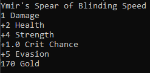

# Helheim

Helheim is a console text-based dungeon crawler. You assume the role of a recently deceased character who is given an impossible task to achieve a second chance at life: kill a god.

## Features

### Randomly Generated Character with a Randomly Generated Name and Randomly Generated Stats.

Lean into the characters initial stats to make a unique experience or mold them into the character you want. Will you assume the role of a legend or another helpless soul trying to get back to Midgard?

### Randomly Generated Weapon System

The weapons in this game have randomized stats that can be upgraded over time. Will you hold out for a god roll, or will you dump mountains of gold to turn the first weapon you see into a god slayer?

### In-Depth Battle System

Evasion, critical hits, critical hit damage boosts, physical attacks, magic attacks. There are a lot of factors that go into this battle system, and a lot of strategies that come out of it. Will you risk attacking an enemy who can kill you with a critical hit, or will you heal and be safe?

### Fight Creatures and Gods from Norse Mythology

Come on, do I even need to explain? Nidhoggr, Magni and Modi, even Odin for goodness sakes! Challenge them and leave victorious; your mortality depends on it.

## Dependencies

To play this game, you need the most recent version of java. You can get that here: https://www.oracle.com/java/technologies/javase-downloads.html

## How to run my game (This is for you, Kenneth)
To run my game you must first download the zip of this repository. Simply go to the main screen and press the green button in the top right that says "Code." You should then see an option to download zip. Once that is downloaded, extract the zip file and enter the Helheim V1.0.0 file. 

First, try to double click the .jar file, you should be put right into the game. This didn't work for me so I made a .bat file for windows that runs the program when you double click it.

If you are on Mac or Linux and the .jar file doesn't execute on double click, then I honestly don't know where to go from there.

## Instructions on Execution With Sample Output

There are a lot of parts to this program, so I can't give sample output for every situation you'll encounter, but I can give a couple that tell you all you need to know about navigating the program.

Here is the battle screen. To navigate, enter a number that correlates with your options then press enter (never never NEVER enter a letter, it will throw an exception and shut down the program). Doing so will bring more options. For example, entering 1 (physical attack) then pressing enter yields:

Now there is output prompting you to choose an enemy to attack. This order goes from left (1) to right (3). There are 2 Jotnar, so the middle one will be 2 while the right one will be 3.

After the player turn comes the enemy turn. This is automated so you don't have to worry about input until you see "Press Enter to Continue..." You will see this many times while playing. When you see this, press enter and you will be taken to the next part of the event.

Enter to Continue and Number Options are the two ways of navigating the game.

Eventually after slaying multiple monsters, you will level up. Leveling up gives you a health (the amount of damage you can take from an enemy) upgrade and mana point regen for free, you also get to choose a stat to level up. From top to bottom the stat descriptions are:

1) MP - Mana Points: Used to cast magic, depletes after each spell. 
2) Strength: Boosts Damage
3) Magic: Increases the potency of your spells
4) Crit Chance: Increases the chance for you to get a critical attack: an attack with boosted damage
5) Crit Damage Boost: Increases the amount of damage your critical attacks do
6) Evasion: Increases the chance of dodging an enemy attack and taking no damage

Finally, here is one of the weapons. From top to bottom it has: 
1. A name 
2. A damage stat that increases how much damage you deal to enemies
3. A list of randomly generated stats that boost your character's stats (refer to stat descriptions above)
4. A gold value. This is used for purchasing weapons from merchants

## Repo Description
You will find the source .java files in the folder named "sourceCode". There is an image folder that contains the images used here. There is a file named Helheim V1.0.0 that contains the .jar file and a .bat file used to run the jar file on windows if the .jar file doesn't run on it's own

## Citations
http://patorjk.com/software/taag/#p=display&f=Graffiti&t=Type%20Something%20
This website gave me the ascii art for the title

### demo code given by CS1 professor at Olympic College: Professor Veliz
The clear screen and sleep methods he provided proved to be vital in my program
